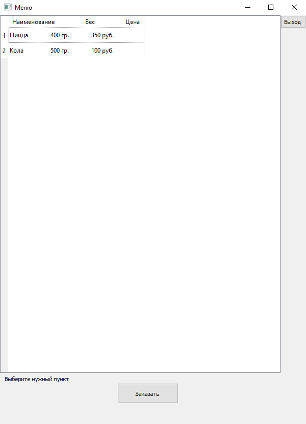

## Описание

Графический интерфейс программы для заполнения заказов в ресторени или кафе.

## Технологии

Интерфейс сделан на PyQt5.
База данных реализована с помощью sqlite3.

## Скриншоты

ссылка на яндекс диск https://disk.yandex.com.am/d/jyNndSfmPJJimA

version 1.1
